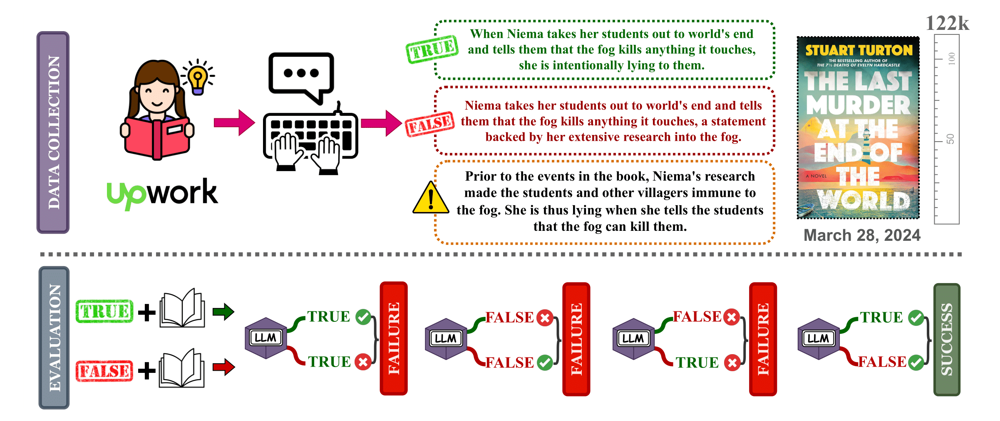

#  
[](https://arxiv.org/abs/2406.16264)

`Paper:` ["One Thousand and One Pairs: A "novel" challenge for long-context language models"](https://arxiv.org/abs/2406.16264)

`Authors:` Marzena Karpinska, Katherine Thai, Kyle Lo, Tanya Goyal, Mohit Iyyer

`Leaderboard:` [Nocha Leaderboard](https://novelchallenge.github.io/index.html)

`TL'DR:` NoCha is a dataset for evaluation loooong context language models' abilities to reason over book-length context. We do NOT release the entire dataset as it contrains new, i.e. copyrighted, books. Instead, we release a sample data build on classic novels and commit to evaluate LMs on the entire dataset ourselves.

## About Nocha

Nocha is a dataset designed to test the abilities of long-context language models to efficiently process book-level input. The model is presented with a claim about a fictional book along with the book text as the context and its task is to validate the claim as either true or false based on the context provided. The test data consists of true/false narrative minimal pairs about the same event or character (see example below). Each false claims differs from its paired true claim _only_ by the inclusion of false information regarding the same event or entity. The model must verify both claims in a pair to be awarded one point. The accuracy is then calculated on the pair level, by counting the number of correctly identified pairs and dividing it by the total pairs processed by the model.

This approach allows has several advantages:

🪄  It allows us to better control the quality of created claims by comparing the true claim with the false claim and identifying claims which are too similar (i.e., the false claim could be true) or subjective;

🪄  It protects from awarding the model for "being right for the wrong reason" as the model has to identify both claims in the pair correctly in order to be awarded one point.

We also measure human accuracy on a subset of our claim pairs and confirm the in ~97% of cases human annotators who have read the books are able to correctly identify _both_ claims in the pair.



Note: This work was inspired by our preliminary results reported in [FABLES: Evaluating faithfulness and content selection in book-length summarization](https://arxiv.org/abs/2404.01261). Check out the Fables paper if you are interested in how well can LLMs utilize their long context for summarization!

## Sample Data

We do NOT release our full dataset as (1) it contains mostly books published in 2023/2024 and hence under copyrights, and (2) we want to prevent model providers from training on the labeled data compromising the dataset. Instead, we annotated also four classic novels, which we provide as a sample of our dataset (see `sample_data`). 

```json
{
      "book_title": "little_women_louisa_may_alcott",
      "claim": "Mr. and Mrs. March originally object to Mr. Bhaer because he is too old and not rich enough.",
      "type": "True",
      "index": 150,
      "false-claim-explanation": "The March parents like Brooke; they object to Bhaer's age and poverty. Aunt March objects to Brooke because he is too poor.",
      "length": 235118,
      "length_bucket": "above 180k",
      "genre": "historical",
      "publication_year": "classics",
      "response-gemini": "<explanation>While the statement mentions concerns that are common in families, the text does not state that Mr. and Mrs. March object to Mr. Bhaer. In fact, they seem to like him from the start. Aunt March is the one who objects to the match because of his lack of wealth. </explanation><answer>FALSE</answer>",
      "response-{model}": "..."
}
```

The `sample_data.json` contains the following information:

`book_title` (`str`): the title of the book followed by the author's name. In the sample data we release four annotated classic novels: "Anne of Green Gables," "Little Women," "The Great Gatsby," and "The Adventures of Sherlock Holmes."

`type` (`str`): label of the claim in pair; either True or False.

`index` (`int`): a number that uniquely identifies both claims in the pair. Each number will appear twice, once for the True claim and once for the False claim in the pair identified by this number.

`claim` (`str`): text of the claim used to prompt the model.

`false-claim-explanation` (`str`): annotator's explanation as to why the False claim in the pair is incorrect.

`length` (`int`): length of the book computed with [tiktoken](https://github.com/openai/tiktoken) using the `cl100k_base` encoding.

`length_bucket` (`str`): one of four lenght categories: below 75k, 75k-127k, 127k-180k, or above 180k tokens.

`genre` (`str`): one of three genres: historical, contemporary, or speculative.

`publication_year` (`str`): for classics we simplify the publication year as one class "classics."

`response-{model}` (`str`): response generated by the given {model} when prompted with this claim and the book at the context.

Additionally, we provide the texts of the classic novels processed for convenience (see `classic_books.pkl` in `sample_data`)

## Prompts

We prompt the models with a claim and the entire book as the context. The prompts used for the experiments described in the paper are available in the `prompts` folder. `prompt.txt` contains prompt used for all models, while `prompt_simple.txt` contains prompt used with open-weights models.


## NoCha Statistics

We provide the statistics for the entire dataset below. Nother tha only a subset is released as sample data in this repo. We do _not_ plan to release the entire dataset to prevent data contamination and due to the books being under copyrights.

|              | **Books**                   | **Books**                   | **Claim** {*pairs*}           | **Claim**  {*pairs*}          | **Claim**  {*pairs*}                   |
|--------------|-----------------------------|-----------------------------|-------------------------------|-------------------------------|-------------------------------|
|              | (*n=67*)                    | (*n=67*)                    | (*n=2002*){*1001*}           | (*n=2002*){*1001*}             | (*n=2002*){*1001*}            |
|              | **Tokens**                  | **Words**                   | **Tokens**                    | **Words**                     | **# Claim/Book**              |
| **Mean**     | 127,324                     | 98,587                      | 23.22                         | 18.26                         | 14.94                         |
| **St. Dev.** | 52,561                      | 39,506                      | 7.62                          | 6.49                          | 8.37                          |
| **Max**      | 336,288                     | 257,445                     | 63                            | 57                            | 46                            |
| **Min**      | 49,156                      | 38,023                      | 5                             | 4                             | 4                             |


## FAQ

🔮 **1. Have you tried different prompts or prompting methods?**

Yes, we experimented with three prompting methods: (1) answer-only, (2) answer followed by explanation, and (3) explanation followed by answer. Details of these experiments can be found in the appendix. We did not try other methods such as few-shot prompting or chunking the text. Few-shot prompting is impractical with book-length input. Since our goal is to test the abilities of LLMs to process *long-context*, chunking the text would defeat the purpose (that being said, you may want to check out the results on stories reported in the paper). Ideally, a model that fully utilizes its claimed context window should handle this task regardless of small differences in prompt wording or order.
   
🌟 **2. How do you ensure that the annotators wrote valid claims?**

Our annotators are avid readers who read the books for their own enjoyment, not specifically for this task. Often, they had access to advance reader copies, enabling us to annotate books before their official publication. Throughout the annotation process, we worked closely with them, reviewing each claim pair multiple times and discussing any unclear details. Asking the annotators to write claim *pairs* as well as *explantions* also made it easier for us to spot potential issues such as the claims being too subjective or too similar (i.e., false claim could also be true). Additionally, we personally read, enjoyed, and annotated 14 books ourselves. 

🧚‍♀️ **3.  Why didn't you test more models?** 

We plan on adding more models. If you are interested in seeing how your model performs on our data please let us know! API credits are certainly welcome!
   
🦄 **4.  Why don't you release your entire annotations?**

We don't release our annotations to prevent model providers from training on them, which could compromise the dataset's integrity. We also plan to periodically update our dataset with "fresh" books and evaluate the models ourselves on the new data. While this approach may seem impractical, it is currently the only way to ensure that we test the models on data they haven't seen during (pre-)training.

## Citation Information
If you use this work in any form, please cite as:
```
@misc{nocha-2024-karp-thai-et-al,
      title={One Thousand and One Pairs: A "novel" challenge for long-context language models}, 
      author={Marzena Karpinska and Katherine Thai and Kyle Lo and Tanya Goyal and Mohit Iyyer},
      year={2024},
      eprint={https://arxiv.org/abs/2406.16264},
      archivePrefix={arXiv},
      primaryClass={cs.CL}
}
```

## License

MIT License.
